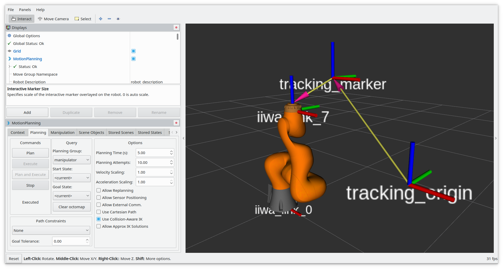

# easy_handeye_demo
This is a demo for [easy_handeye](https://github.com/IFL-CAMP/easy_handeye) which you can try out offline without any 
hardware. It uses MoveIt! and a "noisy" tf publisher to simulate a robot and a tracking system. It also serves as an 
example of how you can integrate `easy_handeye` into your own setup.



This package includes a `calibrate.launch` file which you can use to play around with the calibration software, and a `check_calibration.launch` file to see the impact of a successful calibration.

`calibrate.launch` starts the [iiwa_stack](https://github.com/IFL-CAMP/iiwa_stack) MoveIt! demo, along with the 
`easy_handeye` calibration software and a script which simulates the output of a tracking system according to the 
current state of the simulated robot. You can specify the ground truth value of the calibration. By running the script 
multiple times with different values of the `namespace` argument, you can simulate a multi-sensor environment.
You can adjust the noise added to the computed transformation with the respective launch file arguments.

`check_calibration.launch` also starts the robot control and the tracking simulator, and the `easy_handeye` publisher. 
You can move the robot around with MoveIt! to check that the marker remains at a fixed position with respect to the 
end effector (or robot base, for an eye-on-hand calibration). If the calibration is wrong, this should not be the case.  
This is also an example of how you would integrate the publisher into your own launch file. If you ran the calibration 
script multiple times with different values for the calibration ground truth and namespace, you can modify the launch 
file to include the publisher multiple times and simulate an environment with multiple sensors, individually calibrated.

### Main configuration parameters

- `eye_on_hand` (default false): if true, easy_handeye will be configured to perform an eye-on-hand handeye calibration. Accordingly, the tracking base (e.g. optical camera) reference frame will be attached to the robot hand effector, while the simulated tracking marker frame will be at an arbitrary (but configurable) position in space. If the parameter is false, an eye-on-base calibration will be simulated by attaching the tracking marker frame to the robot hand instead of the camera, and the camera will be at an arbitrary position. 

- `translation_noise_stdev`, `rotation_noise_stdev`: standard deviation of the random noise applied to the tracking transformation.

- `frequency`: the frequency at which the tracking measurement is simulated and published on `tf`.

- `ground_truth_calibration_transformation`: the geometric transformation that should be identified through the calibration procedure. In the eye-on-base case, this is the transformation between the robot base and the tracking base (e.g. camera); in the eye-on-hand case, this is the displacement between the robot end effector and the tracking base. The format is a sequence of seven numbers, each corresponding to the `x y z` values of translation and `x y z w` values of the rotation quaternion.

- `arbitrary_marker_placement_transformation`: this is the residual transformation that closes the circle between robot position, calibration and tracking information. For the eye-on-base scenario, it is the transformation between robot hand and marker, otherwise it is the transformation between robot base and marker. This transformation is not important (it depends on the arbitrary placement of the marker on the robot hand or floor), but it prevents us from measuring the transformation of interest directly and forces us to a calibration process. Hand-eye calibration algorithms are capable to compute the calibration transformation regardless of the value of this arbitrary transformation, given a set of samples. The format is a sequence of seven numbers, each corresponding to the `x y z` values of translation and `x y z w` values of the rotation quaternion.

### Getting started

- clone this repository, as well as iiwa_stack and easy_handeye, within your catkin workspace
```
cd catkin_ws/src
git clone https://github.com/IFL-CAMP/iiwa_stack
git clone https://github.com/IFL-CAMP/easy_handeye
git clone https://github.com/marcoesposito1988/easy_handeye_demo
```
- install the dependencies
```
cd ..
rosdep install -yir --ignore-src --from-paths src
```
- `catkin build`
- source the setup.bash script of your workspace
```
source devel/setup.bash
```
- start the simulation (change the eye_on_hand parameter accordingly)
```
# first perform the calibration
roslaunch easy_handeye_demo calibrate.launch eye_on_hand:=true

# then, check the result
roslaunch easy_handeye_demo check_calibration.launch eye_on_hand:=true
```

### Performing the calibration

Refer to the [easy_handeye documentation](https://github.com/IFL-CAMP/easy_handeye).

The result of the calibration should coincide with the calibration transformation passed as argument, or given as default in the roslaunch file.
